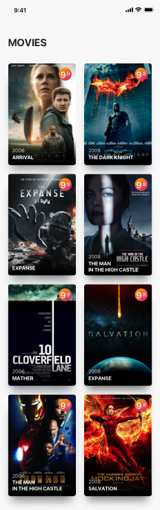
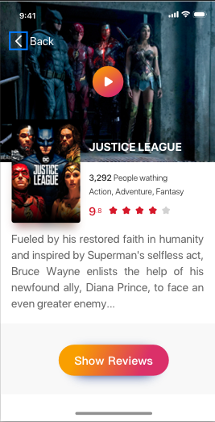
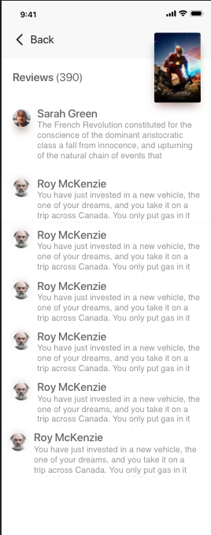

# Mobile Coding Challenge
The goal of this challenge is to give you an opportunity to show us what you know and how you would work in a real-life project with real-life behaviours.

## Introduction
Your local movie theater wants to make things a bit more interesting to attract the younger audience.

To do this, they came up with the idea of building a mobile application so users can see which movies are available to watch, leave reviews, build a community, etc.

They have commended you with the task of building such app. Since it's a first version to test if it's a good product or not, they have chosen a few features to build first and then see what happens.

Since they don't have a backend service, the first version of the application will be built using the public api https://developers.themoviedb.org/3

## Features
The key features of the application will be:

### 1. Discover
After opening the app, users should be able to see a list of movies suggested by the app sorted by popularity.

- API endpoint: https://developers.themoviedb.org/3/discover/movie-discover
- Design reference (available on assets folder):

   

### 2. Movie details
Users should be able to access the details of the movies displayed on the discover section.

- API endpoint: https://developers.themoviedb.org/3/movies/get-movie-details
- Design reference (available on assets folder):

   

### 3. Movie reviews
Users should be able to see a list of user reviews for a specific movie.

- API endpoint: https://developers.themoviedb.org/3/movies/get-movie-reviews
- Design reference (available on assets folder):

   

### 4. Offline mode
The app should be usable offline. Whenever there's no internet, the app should show the latest data that was recieved. Nevertheless, data should have an expiration date. If the latest data was fetched more than a day ago, it shouldn't be used and no data should be shown. This expiration date should be easily changeable, in order to be able to test it/update it. 

## Deliverables

As with any project, the client expects the following deliverables:
- The project's codebase delivered somehow (you pick).
- Anything else you consider is important for understanding the application.

## FAQ

- Do I need to add tests?
  - Tests should be added. Test what you consider important in a mobile application.
- Do I need to follow the designs?
  - The provided designs are just a guideline to give you a reference. Feel free to build the UI as you like. If you find there's something better from the UI/UX perspective, we encourage you to do it.
- Do I need to use some specific libraries?
  - No, build the app with the tools you prefer, there are no limits.
- I'm doing the challenge on react-native, does it need to support both platforms?
  - Yes, that's the fun point of react-native :D.
